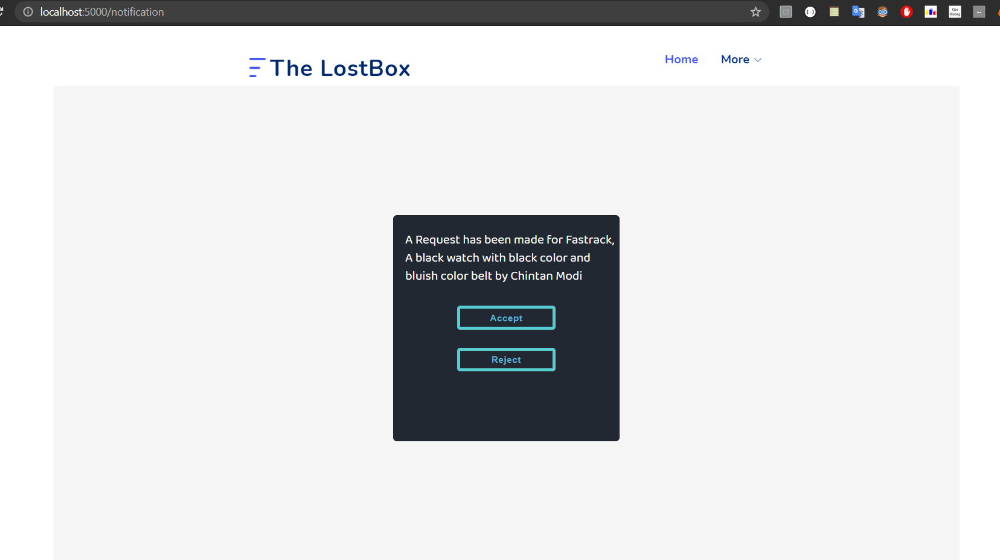
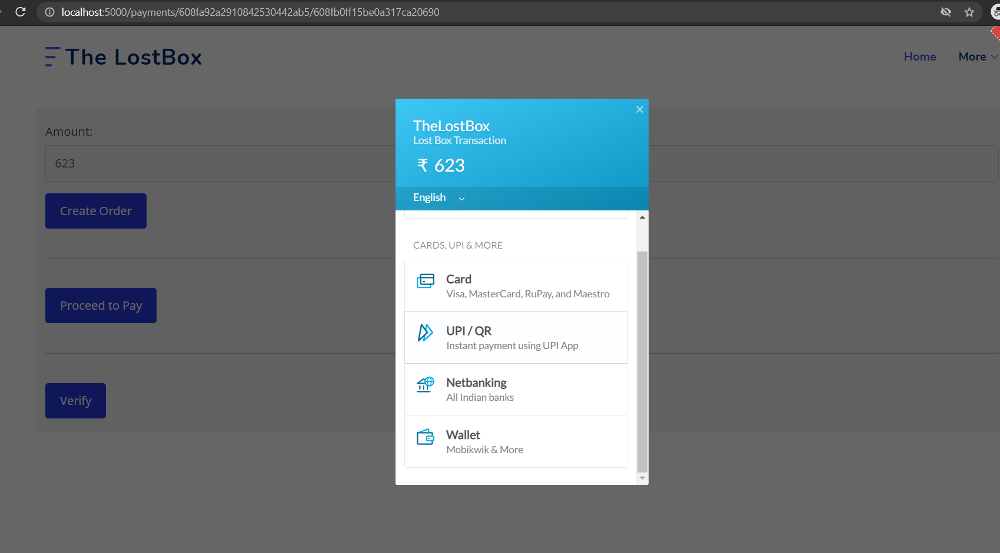

# TheLostBox

## Home

## Login

## The person (who got the lost product) fills in the details of the item/product.

## The owner of the actual product has to fill the Lost Form.

## If the person (who got the lost product) thinks the details mentioned in the lost form (filled by actual owner) is valid, he/she rejects or accepts the request.

## If the person accepts the request, the actual owner can see his lost product/item

## The owner can see his actual lost product and select the options given

## Option for Chat/Messaging_System

## Payment Pages

## Payment using Razorpay

## The details of the transactions in Razorpay site.

## Details of all transactions in Admin page.

## Rewards for the person who found the lost product/item

